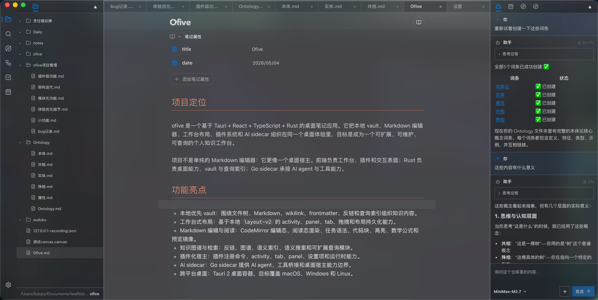

<p align="center">
  
</p>

<p align="center">
  <a href="https://github.com/DnullP/ofive/actions/workflows/ci.yml">
    
  </a>
  <a href="https://github.com/DnullP/ofive/actions/workflows/release.yml">
    
  </a>
  
  
  
  
  
  
  
  
</p>

<h1 align="center">ofive</h1>

<p align="center">
  本地优先的桌面知识工作台，面向 Markdown 笔记、插件化工作流、语义检索和 AI 辅助写作。
</p>

<table>
  <tr>
    <td><strong>Project phase</strong><br />Active development</td>
    <td><strong>Runtime</strong><br />Tauri 2 desktop host</td>
    <td><strong>Knowledge model</strong><br />Local-first Markdown vault</td>
    <td><strong>Quality gate</strong><br />Unit, Rust, Go sidecar, E2E, build</td>
  </tr>
</table>

<p align="center">
  <a href="#功能亮点">功能亮点</a> ·
  <a href="#快速开始">快速开始</a> ·
  <a href="#质量门禁">质量门禁</a> ·
  <a href="#项目文档">项目文档</a>
</p>



## 项目定位

ofive 是一个基于 Tauri + React + TypeScript + Rust 的桌面笔记应用。它把本地 vault、Markdown 编辑器、工作台布局、插件系统和 AI sidecar 组织在同一个桌面体验里，目标是成为一个可扩展、可维护、可查询的个人知识工作台。

项目不是单纯的 Markdown 编辑器：它更像一个桌面宿主。前端负责工作台、插件和交互表面；Rust 负责桌面能力、vault 与查询索引；Go sidecar 承接 AI agent 与工具能力。

## 功能亮点

- 本地优先 vault：围绕文件树、Markdown、wikilink、frontmatter、反链和查询索引组织知识内容。
- 工作台式布局：基于本地 `layout-v2` 的 activity、panel、tab、拖拽和布局持久化能力。
- Markdown 编辑与阅读：CodeMirror 编辑态、阅读态渲染、任务语法、代码块、高亮、数学公式和预览镜像。
- 知识图谱与检索：反链、图谱、语义索引、语义搜索和可扩展查询模块。
- 插件化宿主：插件注册命令、activity、tab、panel、设置项和运行时能力。
- AI sidecar：Go sidecar 提供 AI agent、工具桥接和桌面宿主能力边界。
- 跨平台桌面：Tauri 2 桌面容器，目标覆盖 macOS、Windows 和 Linux。

## 架构概览

```text
ofive/
├─ src/                  React + TypeScript frontend host
│  ├─ host/              Workbench, registry, stores, settings, events
│  ├─ plugins/           Built-in feature plugins
│  └─ api/               Frontend runtime boundaries
├─ src-tauri/            Rust desktop backend and Tauri commands
├─ sidecars/go/          Go AI sidecar
├─ docs/wiki/            Project knowledge base, readable as an ofive vault
└─ ../layout-v2/         Local shared workbench layout dependency
```

## 快速开始

### 前置要求

需要安装：

- Bun
- Rust stable toolchain
- Go

说明：

- 项目脚本会自动下载并缓存固定版本的 `protoc` 到 `.tools/protoc/`。
- `bun run tauri dev` 会先构建 sidecar。
- 如果直接运行 `cargo test` 或 `cargo build`，仍需要自行安装 `protoc` 或设置 `PROTOC`。

### 安装依赖

```bash
bun install --frozen-lockfile
```

### 启动 Web 调试

```bash
bun run web:dev
```

访问：

```text
http://127.0.0.1:4173
```

### 启动桌面开发模式

```bash
bun run tauri dev
```

### 构建桌面应用

```bash
bun run tauri build
```

## 常用命令

| 命令 | 用途 |
| --- | --- |
| `bun run web:dev` | 启动纯前端开发服务 |
| `bun run tauri dev` | 启动 Tauri 桌面开发模式 |
| `bun run build` | 运行前端守卫、构建 `layout-v2` 并生成 Web 产物 |
| `bun run build:sidecar` | 构建 AI sidecar |
| `bun run proto:generate` | 只生成 sidecar protobuf 代码 |
| `bun run proto:check` | 检查生成的 Go stubs 是否最新 |
| `bun run test` | 运行前端单元测试 |
| `bun run test:rust` | 运行 Rust 测试 |
| `bun run test:e2e` | 运行 Playwright E2E |
| `bun run test:full` | 执行完整测试工作流 |

## 质量门禁

CI 将核心验证拆成多条独立链路：

- Go sidecar 测试与构建
- 前端单元测试
- Rust core / sidecar 测试
- Playwright E2E
- 生产构建
- 发布版本校验

本地交付前建议至少运行：

```bash
bun run build
bun run test
bun run test:rust:core
```

涉及 sidecar、协议或 AI 工具能力时，再补充：

```bash
bun run test:go
bun run build:sidecar
bun run proto:check
```

## 发布

Release workflow 只会在标准版本 tag 推送后触发。tag 必须使用 `v0.0.1` 或 `v0.0.1-alpha` 这类 SemVer 格式，并且要和 `package.json`、`src-tauri/tauri.conf.json`、`src-tauri/Cargo.toml` 中的版本号一致。

```bash
git tag v0.1.0
git push origin v0.1.0
```

当前公开发布包使用 `--no-sign` 构建，不做 Apple Developer ID 签名和 notarization。首次打开 macOS 包时，如果系统提示无法验证开发者，可以先拖入 `/Applications`，再按需移除 quarantine 标记：

```bash
xattr -dr com.apple.quarantine /Applications/ofive.app
```

## 平台构建前提

### macOS

```bash
xcode-select --install
brew install oven-sh/bun/bun go
curl --proto '=https' --tlsv1.2 -sSf https://sh.rustup.rs | sh
rustup default stable
```

### Windows

```powershell
winget install --id Oven-sh.Bun -e
winget install --id Rustlang.Rustup -e
winget install --id GoLang.Go -e
winget install --id Microsoft.EdgeWebView2Runtime -e
rustup default stable
```

首次编译 Rust/Tauri 项目还需要 Visual Studio 2022 Build Tools，并勾选 `Desktop development with C++`。

### Linux

以下以 Ubuntu 22.04 为基准：

```bash
sudo apt-get update
sudo apt-get install -y \
  build-essential \
  curl \
  file \
  golang-go \
  libayatana-appindicator3-dev \
  librsvg2-dev \
  libssl-dev \
  libwebkit2gtk-4.1-dev \
  libxdo-dev \
  patchelf \
  wget
curl -fsSL https://bun.sh/install | bash
curl --proto '=https' --tlsv1.2 -sSf https://sh.rustup.rs | sh
rustup default stable
```

## 项目文档

开发和维护者入口：

- [docs/README.md](docs/README.md)
- [docs/wiki/ofive-project-wiki.md](docs/wiki/ofive-project-wiki.md)
- [docs/wiki/ofive-maintainer-dashboard.md](docs/wiki/ofive-maintainer-dashboard.md)
- [docs/wiki/ofive-feature-owner-map.md](docs/wiki/ofive-feature-owner-map.md)
- [docs/wiki/ofive-build-and-dev-workflow.md](docs/wiki/ofive-build-and-dev-workflow.md)
- [docs/wiki/ofive-testing-and-ci.md](docs/wiki/ofive-testing-and-ci.md)

`docs/wiki/` 使用 ofive 的笔记管理逻辑组织：Markdown + YAML frontmatter + wikilink。可以在 ofive 内作为项目 vault 阅读、搜索、查询 frontmatter、查看反链和知识图谱。

## 常见问题

### `go: command not found`

Go 未安装，或当前终端尚未加载最新 PATH。重新打开终端后检查：

```bash
go version
```

### `Executable not found in $PATH: protoc`

通过 `bun run test:rust`、`bun run tauri dev`、`bun run tauri build` 或 `bun run build:sidecar` 执行时，脚本会自动准备固定版本的 `protoc`。

如果你直接运行 `cargo test`、`cargo build` 或 IDE 内部直接调用 Cargo，需要安装系统级 `protoc`，或显式设置：

```bash
PROTOC=.tools/protoc/<version>/<platform>/bin/protoc
```

### `protoc-gen-go: The system cannot find the file specified`

通常是 sidecar 代码生成阶段失败。先执行：

```bash
bun run build:sidecar
```
